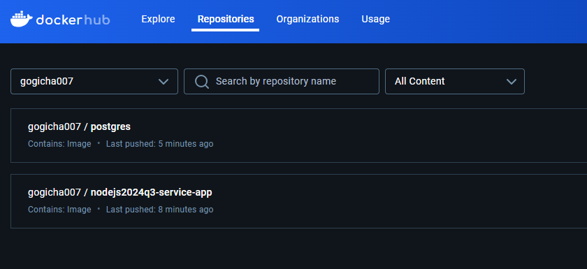

# Home Library Service 3

images uploaded to my docker hub :



## Prerequisites

- Git - [Download & Install Git](https://git-scm.com/downloads).
- Node.js - [Download & Install Node.js](https://nodejs.org/en/download/) and the npm package manager.

## Downloading

```
git clone {repository URL}
```

## Installing NPM modules

```
npm install
```

## change repository branch

```
git checkout dev_hl_3
```

## .env

rename .env.example to .env

## Running application

```
docker compose build

docker compose up
```

This will run 2 docker containers - one with Postgres database, another with NestJS application on ports from .env.

## Testing

After application running open new terminal and enter:

To run all test with authorization

```
npm run test:auth
```


## features

### logging in files

log directory located in root. errors and other logs are saved separately in errors.log and logs.log files. After reaching max size defined in .env the log files are archived in separate files with extensions .error and .log.

